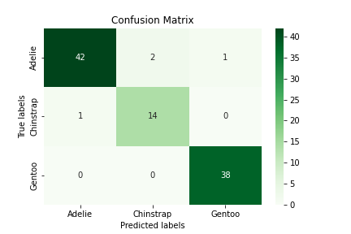
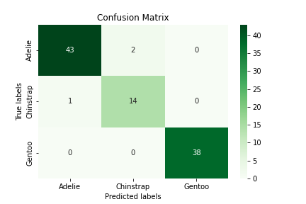

# Palmer Penguins
## Group Members: 
Jiayun Meng and Qinhan Hu
## Description
The aim of this project is to determine the best combination of features (one qualitative feature and two quantitative features) of the penguins to predict the species of a penguin. Run palmer_penguins.csv to see the demo!
## Data
The penguins data set we use was collected by collected by [Dr. Kristen Gorman](https://www.uaf.edu/cfos/people/faculty/detail/kristen-gorman.php) and the [Palmer Station, Antarctica LTER](https://pallter.marine.rutgers.edu/), a member of the [Long Term Ecological Research Network](https://lternet.edu/).
[Check the CSV](https://github.com/JiayunMeng/group_project_pic16a/blob/main/palmer_penguins.csv) data. It contains measurements on three penguin species: Chinstrap, Gentoo, and Adelie. 
## Install Packages
To run our jupyter notebook file, make sure to run all the code cells. Nothing else is needed to run our files.
## Detailed Description of the Project
### Preparation of Data
In this part, we clean the dataset with the function prep_data(). We shorten the name of the species, remove the columns that are intuitively irrelevant to species, delete the wierd data and transform some columns into numerical values. You can check the code of the function prep_data() in our penguins.py.
### Combinations of Features
We determine all possible combination of one qualitative feature and two quantitative features.
### The Best Combination
In this section, we introduce a class pred_alg_comb. The algorithms are restricted to Random Forest rf and Gradient Boosting gb. By using this class, we find the best combination features of our dataset and produce the score of our models. Besides, there are three kinds of errors presented in this part.
### Check the Model
We explore the dataset a bit to illustrate that the selected predictors from our function are reasonable. We further plot the confusion matrix to evaluate the performance of our models.

Gradient Boosting:

Random Forest:

## Limitations ad Future Work
The best combination varies as the splitting of the training and testing sets varies and the Random Forest testing itself gives different results each time.

We only determine 3 features of the penguins to classify the species of a penguin. If we have more time, we would like to produce a combination of more features so we can classify the penguin species more accurately.

## License
Licensed under the [MIT License](https://github.com/JiayunMeng/group_project_pic16a/blob/main/LICENSE).

## Acknowledgement
We would like to express our sincere gratitude to Professor Harlin Lee for teaching us PIC 16A this quarter and all the help, guidance, consideration and encouragement.
We are also grateful to TA Shruti Mohanty for her valueable help, advice and discussions.

## References
Chodrow, Phil. "PIC16A Group Project", https://www.philchodrow.com/PIC16A/project/.

